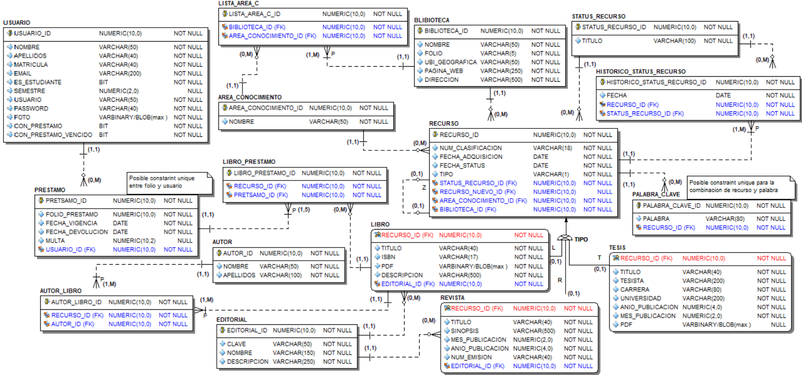
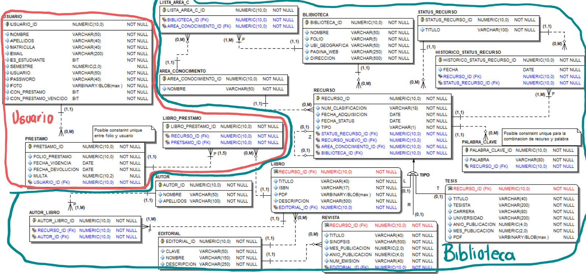

**PROYECTO BDA.**
==

En estre proyecto se realiza la creación de una base de datos desde consola con
el fin de poner en prcatica los conceptos de adminstricacion de una base de datos
utilizando Oracle 19c en un sistema operativo linux. Adicionalmente, se creara 
e implemenrara un modelo relacional con base en las siguientes reglas de negocio.

> ADMINISTRACIÓN DE BIBLIOTECAS
> 
> La siguiente base de datos será construida para controlar las diversas bibliotecas con las que cuenta una universidad a nivel nacional. De cada
biblioteca se almacena su nombre, un folio único de 5 caracteres, su ubicación geográfica (latitud, longitud), su dirección de su página web y su dirección.
Cada biblioteca ofrece recursos de distintas áreas de conocimiento por ejemplo, biología, matemáticas, historia, etc. Se almacena la lista de áreas
de conocimiento de cada biblioteca.
El concepto de recurso se refiere a los elementos que una biblioteca ofrece a sus usuarios. Las bibliotecas ofrecen 3 tipos: libros, revistas.
Independiente del tipo, para cada recurso se almacena su número de clasificación (alfanumérico formado de 3 secciones o grupos de caracteres, en total
son 18 caracteres). Se registra la fecha de adquisición del material, el área de conocimiento al que pertenece. Para controlar la situación de cada material,
se ha definido una serie de status: Disponible para préstamo, en préstamo, solo de consulta en sala, dañado, en reparación, extraviado, en préstamo
expirado. Se desea almacenar su status actual, fecha de status y el histórico de valores a lo largo del tiempo. Para realizar consultas rápidas, cada recurso
almacena un listado de palabras clave. La única limitante para registrar palabras es que estas deben ser sustantivos y no deben duplicarse. Pudieran
estar registradas el 100% de los sustantivos que tiene un libro.
Al paso del tiempo, un recurso puede salir de servicio por diversas causas. La más común por antigüedad. El recurso debe ser reemplazado por uno
nuevo. Para garantizar esta regla, al recurso viejo se le asocia el recurso que lo va a reemplazar.
Para los libros se almacena ISBN, título, editorial y su lista de autores. Se cuenta con un catálogo de editoriales en el que se guarda clave, nombre
y descripción. Para cada libro se guardan un PDF con un breve resumen del libro para ser promocionado en la página. Para el caso de las revistas se
almacena su título, sinopsis, el año y mes de publicación, nombre de la empresa que la edita y el número de emisión. Para las tesis, se almacena el título
de la tesis, el nombre completo del tesista, la carrera, el nombre de la universidad, el mes y año en la que se publicó. En algunos casos la tesis también
se encuentra en formato digital. Se almacena el documento PDF.
La biblioteca cuenta con un registro global de usuarios. Para cada uno se almacena, nombre, apellidos, número de matrícula, email obligatorio,
número de semestre (en caso de ser estudiante aun), username y password empleados para el sitio web. Al registrarse, el usuario debe tomarse una
foto la cual se debe almacenar.
Para realizar un préstamo se realiza el siguiente procedimiento: El usuario puede solicitar cualquier número de préstamos, pero uno a la vez. Un
préstamo no puede tener más de 5 libros. Cada préstamo tiene un periodo de vigencia. Cuando se le otorga un préstamo a un usuario se prende una
bandera llamada “con préstamo”. Cuando la vigencia del préstamo expira, se prende otra bandera llamada “con préstamo vencido”. Al entregar los
libros se almacena la fecha de entrega y en caso de aplicar el importe de la multa del préstamo por entrega tardía o por maltrato de recursos.
Cada usuario cuenta con su consecutivo de préstamos iniciando en 1.

Modelo relacional del caso de estudio. 

Este modelo sera dividido en 2 modulos y cada uno de ellos sera administrado por un usuario particular
|Modulo|Descripción|Usuario|
|------|-----------|-------|
|Usuario|Objetos y funcionalidades relacionadas a los usuarios y sus préstamos|heza_usuario
|Biblioteca|Objetos y funcionalidades relacionadas a las bibliotecas, áreas de conocimiento, recursos y status del recurso|heza_biblioteca|

Cálculo de la FRA
|Variable|Tamaño (Mb)|
|--------|-----------|
|Tamaño de una copia de la base de datos|681.09|
|Tamaño de un backup incremental nivel 1|20.67|
|Tamaño de los archive redo logs que se producirán en N+1 días (N = 6)|268.079|
|Tamaño del backup set que contiene el archivo de control|17.83|
|Tamaño de los flashback logs|60|
|Tamaño de uno de los miembors de redo logs * (N+1)|200|
|Total de espacio estimado para la FRA|1361.4359 => 1400 => 1600|

## Cotenido del respositorio 
---

En el repositorio se podran encontrar la siguiente lista de scripts:

| Nombre del script | Descripción |
|-------------------|-------------|
| s-01-crear-loop-devices.sh| Creación de los directorios donde se encontraran diferentes archivos de la base de datos y simulacion de puntos demontaje usando loop devices para multiplexar algunos archivos.|
|s-02-crea-pwd-param-oracle.sh| Creación del archivo de password y pfile con parametros inciales de la base de datos|
|s-03-creacion-bd.sql|Creación de la base de datos usando el comando create database|
|s-04-modos-conexion.sql| Configuracion de parametros necesarios para contar con modos de conexion dedicado y compartido|
|s-05-mod-archivelog.sql|Configuracion necesaria para habilitar el modo archivelog|
|s-06-crea-tablespaces.sql| Creación de los tablespaces necesarios para cada modulo asi como un tablespace compartido para campos blob|
|s-07-crea-usarios.sql| Creación de usuarios por modulo y asigancion de privilegios para crear objetos|
|s-08-ddl-biblioteca.sql| Creación de tablas e indices del modulo biblioteca|
|s-09-ddl-usuario.sql| Creación de tablas e indices del modulo usuario|
|s-10-carga-biblioteca.sql| Carga inicial de datos para el modulo biblioteca|
|s-11-carga-usuario.sql| Carga inicial de datos para el modulo usuario|
|s-12-redo-biblioteca.sql| Genereaciòn de datos de redo para modulo biblioteca|
|s-13-redo-usuario.sql| Genereaciòn de datos de redo para modulo usuario|
